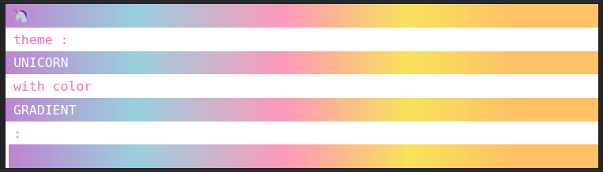

# @catpic/console-highlighter

Highlight console log messages with style.

### Features
- themeable
- customizable
- automatic highlighting (variables used in template strings will be highlighted)

### How to
```ts
yarn add @catpic/console-highlighter
```

```ts
const highlighter = new Highlighter({theme: 'dracula'})

highlighter.highlight.yellow`${count} messages sent.`

```

The listed emojis may be used in log message like so: `this message is :fire:`

```ts
export const emojis = {
  poop: "💩",
  happy: "😀",
  unicorn: "🦄",
  rainbow: "🌈",
  party: "🎉",
  heart: "❤️",
  bomb: "💣",
  bang: "💥",
  dynamite: "🧨",
  fire: "🔥",
};


```


Themes may be customized using [supported CSS properties](https://developer.mozilla.org/en-US/docs/Web/API/console#usage). 

```ts
const highlighter = new Highlighter({ 
  theme: 'unicorn'
  styles: { line: () => "display: block;" },
})
```




### TODO
- [ ] Expose combinators for building custom highlighters.
