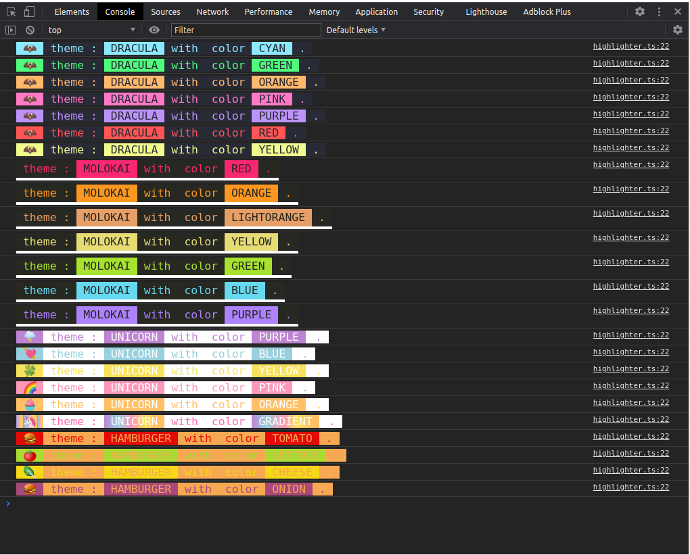

# console highlighter

Highlight console log messages with style.

### features
- themeable
- customizable
- variables used in template strings will be highlighted

### install
```ts
yarn add @catpic/console-highlighter
```

```ts
const highlighter = new Highlighter({theme: 'dracula'})

dracula.highlight.yellow`failure to download: ${link}`
```




